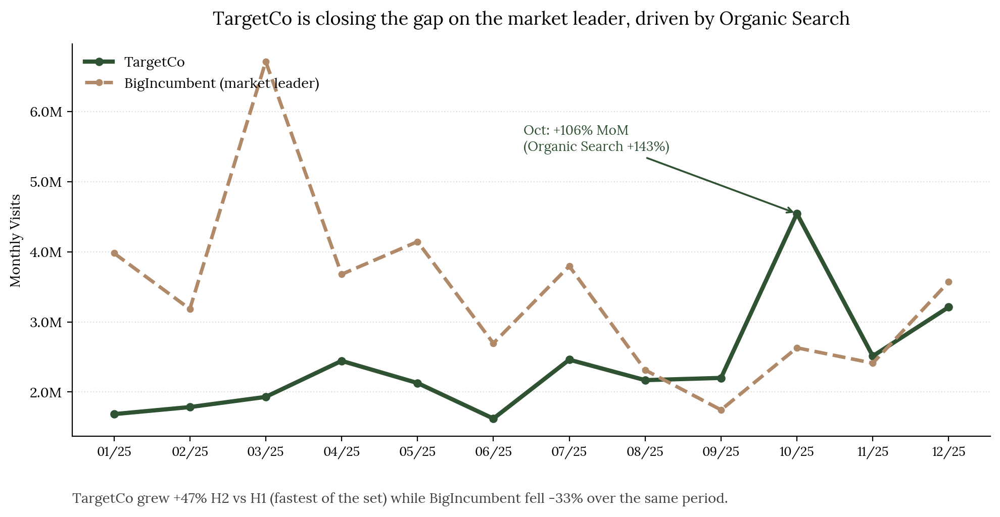

# Competitor Web Traffic Analysis — Excel & Python

## Objective

Analyze a year of web traffic data across five companies in a shared market, to identify the most defensible growth signal and produce an actionable, board-ready recommendation, in the context of a technical assessment for a data analytics role.

## Method

- **Workbook architecture**: designed so that Raw Data is the only tab with typed-in values — every other tab (Monthly Totals, Channel Mix, Quality Scorecard) references it via formula, with zero hardcoded results. Excluded data points (e.g. a tracking outage month) were flagged with an `is_valid_month` column rather than deleted, keeping every exclusion auditable.
- **Scorecard design**: built two parallel methodologies — equal-weighted and **visit-weighted** — to fairly compare companies ranging from 4M to 41M annual visits. A small channel with a few hundred visits shouldn't swing a score as much as organic search with hundreds of thousands; visit-weighting keeps the channels that actually drive the business proportionally represented. Both versions are kept visible in the output, not just the one used for the final call.
- **Verification discipline**: every number in the write-up — including secondary figures like "106%" and "38.9%," not just the headline stats — was cross-checked against the workbook before submission. All formulas in the workbook were recalculated to confirm zero errors, and every key figure was independently rebuilt in Python, compared to six decimal places against the Excel output.

## Key finding

TargetCo grew **+47.5%** in H2 vs. H1 2025, the fastest momentum of the five companies in the set, while the market leader (BigIncumbent, roughly 40.9M annual visits vs. TargetCo's 28.7M) **fell -32.5%** over the same period. Most of that growth traces to a single event: an October spike of **+106% month-over-month**, driven overwhelmingly by Organic Search (**+143%** that month) — consistent with Organic Search already being TargetCo's largest channel (38.9% of annual visits, the highest share in the set).

Growth wasn't coming at the cost of traffic quality: TargetCo posted the lowest bounce rate in the set (39.4%, visit-weighted) and the second-highest pages-per-visit (4.68). By contrast, the company with the heaviest paid-search reliance (nearly 40% of its traffic) had the worst bounce rate of the group — paid spend was buying volume, not engagement.

## Recommendation

Don't chase the paid-media playbook. TargetCo's organic channel is simultaneously its largest, fastest-growing, and highest-quality — the evidence points to doubling down on SEO/content investment rather than shifting budget toward paid acquisition. Before committing budget, the open question flagged in the write-up is what specifically drove the October spike, since that determines how aggressively to invest behind the finding.

## How I used AI

I started out treating AI as an execution tool: describe the task, get a script, check the output. That broke down almost immediately, because the brief asked for judgment calls, not just processed numbers — and I couldn't defend a judgment call on something I didn't actually understand myself.

The shift: I stopped accepting formulas and decisions at face value, and had every one explained back to me, term by term, until I could reproduce the reasoning independently. The clearest example is the Quality Scorecard's weighting formula — I had each component broken down (what it does, why repeated channel rows don't silently inflate the result, why the division cancels a duplication factor algebraically) and re-derived the number myself before trusting it. That became the standard I held every other formula to afterward.

This discipline caught a real mistake along the way: a first verification pass misread a wrapped two-line column header and pulled a value from the wrong column, producing a number that *looked* plausible in isolation — exactly the kind of error that slips through if you only glance at it. It didn't survive because the rule was already set: nothing gets accepted without being traced back to a header cell by cell, not read off a printed value. Re-printing the header row and counting column indices by hand caught the mismatch immediately.

By the end, the working relationship had flipped from "produce this for me" to "defend this to me until I can defend it myself" — which is why I can trace every number and methodology choice in this submission back to its source and explain the reasoning without reading from a script.

## Tools used

Excel (advanced formulas, scorecard modeling), Python (pandas, matplotlib, independent validation).

---

[← Back to home](README.md)
