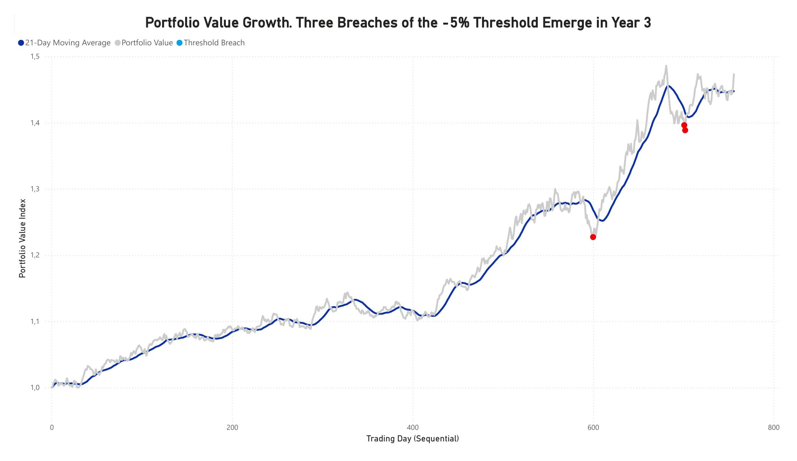
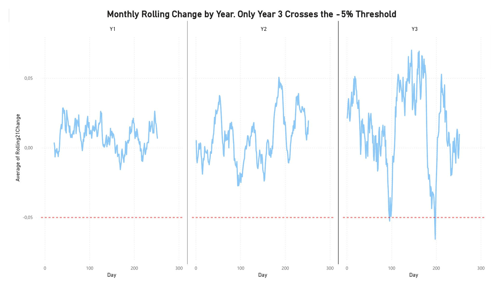

# Loan Portfolio Backtesting — Power BI

## Objective

Build a Power BI model to backtest a loan portfolio against a defined breach threshold on a rolling 21-business-day change, across three years of daily portfolio index data. This was completed as a technical exercise applying real-world risk monitoring methodology.

## Method

- **Data modeling**: cleaned and transformed the raw dataset in Power Query, building a continuous sequential index to correctly handle year boundary resets.
- **DAX measures built**:
  - Rolling 21-business-day percentage change
  - A breach flag for periods where the rolling change drops below the defined threshold
  - Daily and annualized change (based on 252 trading days)
  - Annualized standard deviation — using population standard deviation (STDEV.P), not sample (STDEV.S), since the full dataset was available rather than a sample
  - A 21-day moving average via AVERAGEX + FILTER
  - A helper column to highlight breach points on the chart

## Key finding: a real data bug

While cross-validating every DAX result independently in Python, I discovered a **data localization issue**: decimal points in the source data were being misread due to locale settings, silently inflating certain values by a large factor. Catching this before finalizing the analysis was only possible because I treated the Python cross-check as a real validation step, not a formality — comparing every key output line by line rather than trusting the DAX results at face value.

## Visualizations

## Results & Recommendation

The portfolio grew steadily over the three-year period, with a small number of threshold breaches concentrated in the most recent year, where both the annualized change and annualized standard deviation were markedly higher than in prior years.

**Recommendation**: rather than widening the breach threshold (which would mask legitimate risk signals), the model should be periodically recalibrated to reflect the portfolio's evolving volatility profile.

## Tools used

Power BI (Power Query, DAX), Python (independent validation), Excel.

---

[← Back to home](README.md)
